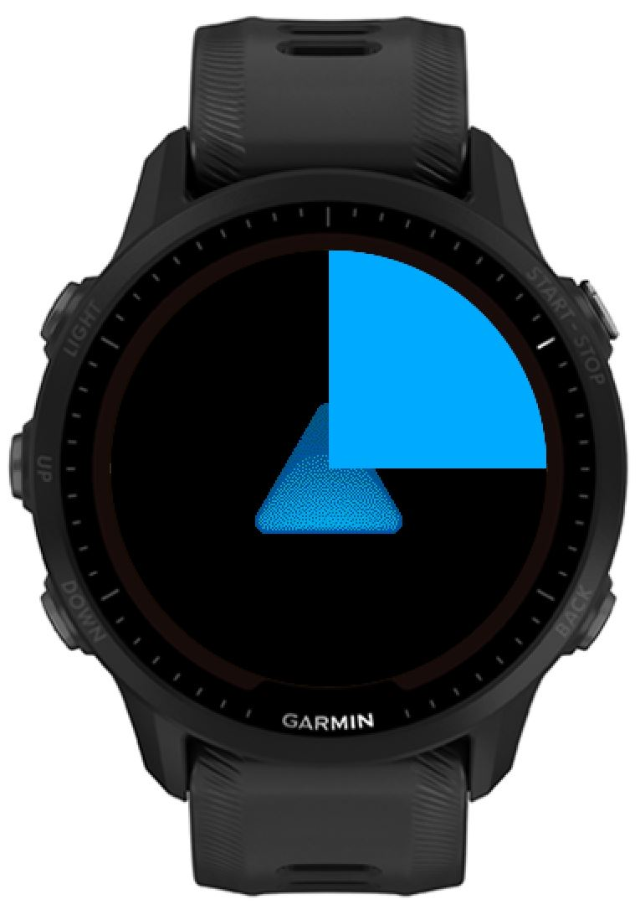

# Performance notes of Garmin drawing routines

All tests ran in simulator with FR955

## 1. Drawing full bitmap from BufferedBitmapReference:

`Ex01FullBitmapDraw`, simply draw whole bitmap on each update:


```
dc.drawBitmap(0, 0, buffer);
```

Total time: **55123** \
Execution time: **862** \
Graphics time: **181** \
Display time: **54080**

## 2. Drawing half of bitmap BufferedBitmapReference with setClip

Example view: `Ex02HalfBitmapDrawClip` in low power mode:


```javascript
dc.setClip(0, 0, dc.getWidth(), dc.getHeight() / 2);
dc.drawBitmap(0, 0, buffer);
```

Total time: **28202** \
Execution time: **1062** \
Graphics time: **100** \
Display time: **27040**

## 2. (B) Drawing right half of bitmap BufferedBitmapReference with setClip

Example view: `Ex02HalfBitmapDrawClip02`, this is where it gets confusing. Drawing right half takes as long as drawing whole screen!


```javascript
dc.setClip(dc.getWidth() / 2, 0, dc.getWidth() / 2, dc.getHeight());
dc.drawBitmap(0, 0, buffer);
```

Total time: **55398** \
Execution time: **1137** \
Graphics time: **181** \
Display time: **54080**

## 3. Drawing half of bitmap BufferedBitmapReference with drawOffsetBitmap

`Ex03HalfBitmapDrawOffset` notably, this renders exactly same screen as 2. but is very slow! First finding! Never use `drawOffsetBitmap`, instead use `setClip` like in previous.


```javascript
dc.drawOffsetBitmap(0, 0, 0, 0, dc.getWidth(), dc.getHeight() / 2, buffer);
```

Total time: **55285** \
Execution time: **1024** \
Graphics time: **181** \
Display time: **54080**

## 4. Drawin quarter of full bitmap with setClip

`Ex04QuarterBitmap` another finding! This takes longer than drawing half a screen of bitmap? What is going on?



```javascript
dc.setClip(dc.getWidth() / 2, 0, dc.getWidth() / 2, dc.getHeight() / 2);
dc.drawBitmap(0, 0, buffer);
```

Total time: **28289** \
Execution time: **1149** \
Graphics time: **100** \
Display time: **27040**

## 5. Drawing quarter of quarter bitmap with drawBitmap's offset

`Ex05QuarterBitmapOffset` another finding! This takes longer than drawing quarter of a screen of bitmap, this time `drawBitmap` first and second argument are not helping!


```javascript
// onLayout
var buffer = Graphics.createBufferedBitmap({
    :width => dc.getWidth() / 2,
    :height => dc.getHeight() / 2,
})

// onPartialUpdate:
dc.drawBitmap(dc.getWidth() / 2, 0, buffer);
```

Total time: **55198** \
Execution time: **938** \
Graphics time: **181** \
Display time: **54080**

## 6. Drawing quarter of quarter bitmap with drawBitmap's offset and dc setClip

`Ex06QuaterBitmapClip` here we seem to prove that cutting your bitmaps to smaller pieces does not in fact give performance benefits. So far most convinient way to draw a quarter is 4. with just simple setClip.


```javascript
// onLayout
var buffer = Graphics.createBufferedBitmap({
    :width => dc.getWidth() / 2,
    :height => dc.getHeight() / 2,
})

// onPartialUpdate
dc.setClip(dc.getWidth() / 2, 0, dc.getWidth() / 2, dc.getHeight() / 2);
dc.drawBitmap(dc.getWidth() / 2, 0, buffer);
```

Total time: **28364** \
Execution time: **1224** \
Graphics time: **100** \
Display time: **27040**

## 7. Drawing small rectangles (smaller than quarter of screen) from full bitmap with setClip

`Ex07SmallClips` another finding, re-drawing a same buffer with different clips is total waste. This is slower than drawing half of the screen!


```javascript
dc.setClip(0, 0, 50, 50);
dc.drawBitmap(0, 0, buffer);
dc.setClip(50, 50, 50, 50);
dc.drawBitmap(0, 0, buffer);
dc.setClip(100, 100, 50, 50);
dc.drawBitmap(0, 0, buffer);
```

Total time: **33974** \
Execution time: **2624** \
Graphics time: **150** \
Display time: **31200**
